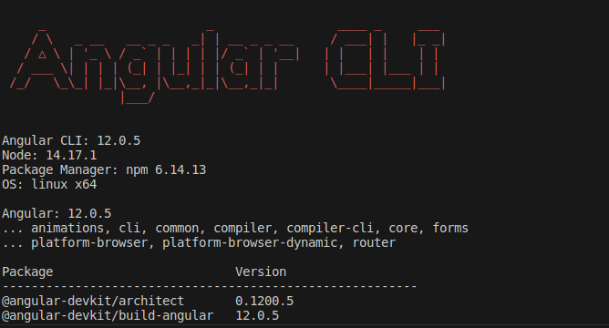
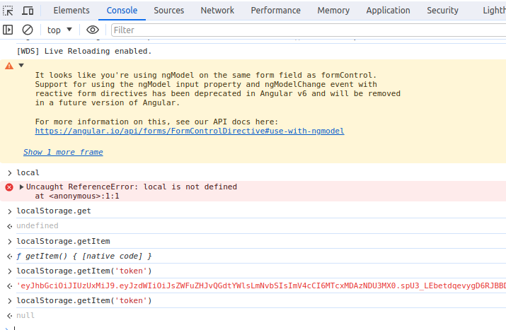

# ProjectCRM

This project was generated with [Angular CLI](https://github.com/angular/angular-cli) version 12.0.3.

* Documentação do Angular: https://angular.io/docs
* Documentação angular DEV: https://angular.dev/
* Documentação do Angular Material: https://material.angular.io/components/categories
* site para cores css: https://cssgradient.io/
* convert png para tipo verto: https://www.pngtosvg.com/ - https://convertio.co/pt/png-svg/ 

## Passos para rodar o projeto

* Instalando o gerenciador **nvm** de pacotes node: https://tecadmin.net/how-to-install-nvm-on-ubuntu-20-04/

* Instalando uma determinada versão node 14.17.1: `nvm install 14.17.1`

* instalando uma determinada versão do angular: `npm install -g @angular/cli@12.0.3`

* gerando o guard para proteger as rotas: `ng generate guard nomePasta/auth`

* Instalando os modulos node: `npm install`
* Gerando service para comunicação com a API: `ng generate service services/cliente`

## Development server

Run `ng serve` for a dev server. Navigate to `http://localhost:4200/`. The app will automatically reload if you change any of the source files.

## Code scaffolding

Run `ng generate component component-name` to generate a new component. You can also use `ng generate directive|pipe|service|class|guard|interface|enum|module`.

## Build

Run `ng build` to build the project. The build artifacts will be stored in the `dist/` directory.

## Running unit tests

Run `ng test` to execute the unit tests via [Karma](https://karma-runner.github.io).

## Running end-to-end tests

Run `ng e2e` to execute the end-to-end tests via a platform of your choice. To use this command, you need to first add a package that implements end-to-end testing capabilities.

## Further help

To get more help on the Angular CLI use `ng help` or go check out the [Angular CLI Overview and Command Reference](https://angular.io/cli) page.

## Adicionando angular material 
* `ng add @angular/material`

## gerando componentes
* `ng generate component components/nav`

## instalando o Ngx-toastr (alerta mensagens)
* Link: https://www.npmjs.com/package/ngx-toastr
* versão usada:  14.3.0
* instalando no projeto fixo: `npm install ngx-toastr@14.3.0 --save`
* test: https://ngx-toastr.vercel.app/

## instalando o angular-jwt (autenticação)
* Link: https://www.npmjs.com/package/angular-jwt
* versão usada:  5.0.2
* instalando a versão fixa: `npm install @auth0/angular-jwt@5.0.2 --save`

* Verificando se foi limpo o localStorage: `localStorage.setItem('token')`
